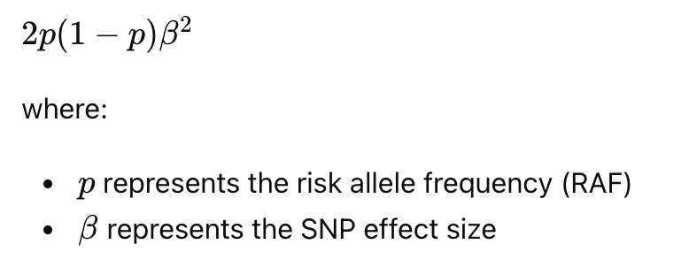
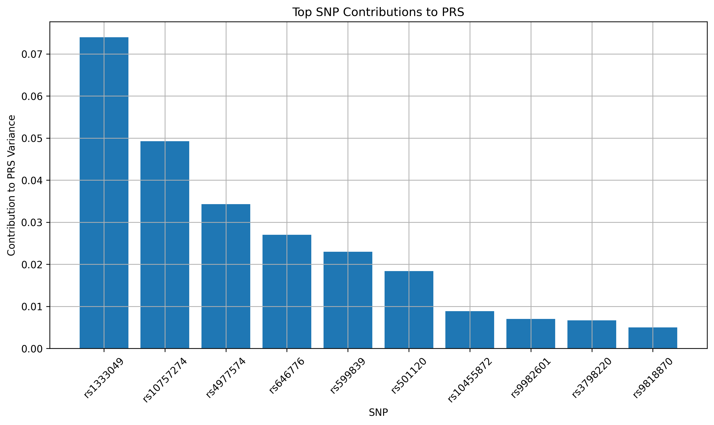

Basically, what I did was create code to identify which SNPs contribute most strongly to CAD risk.

I used this dataset:
[https://docs.google.com/spreadsheets/d/1IlSFTSaMOc8Zpo8SFytIKrBtFUc9s5B0BZuvoY3ahQU/edit?usp=sharing)

In the dataset:

* RAF represents how frequently the risk allele appears in the population
* OR/Beta represents how strongly the variant affects CAD risk

OR and Beta are basically equivalent because:

\beta = \log(OR)

I included both because some SNPs data only had OR values available, while others only had Beta values.

Based on these values, I generated 1000 simulated individuals and developed a simple algorithm to estimate which SNPs contribute most strongly to CAD risk using both RAF and OR/Beta.

in order to calculate how strongly each SNP contributed to overall PRS variability in the population, I used




This is part of the result:



```text
          rsID                     gene    RAF      beta  contribution
0    rs1333049               CDKN2B-AS1  0.470  0.385262      0.073946
2   rs10757274               CDKN2B-AS1  0.460  0.314811      0.049236
1    rs4977574               CDKN2B-AS1  0.530  0.262364      0.034294
5     rs646776            CELSR2, PSRC1  0.790  0.285179      0.026984
4     rs599839            PSRC1, CELSR2  0.770  0.254642      0.022967
8     rs501120     LINC00841, LINC03089  0.870  0.285179      0.018396
20  rs10455872                      LPA  0.065  0.270027      0.008863
16   rs9982601  MRPS6, KCNE2, LINC00310  0.150  0.165514      0.006986
19   rs3798220                      LPA  0.020  0.412110      0.006658
12   rs9818870                     MRAS  0.150  0.139762      0.004981
```

As you can see, SNPs in the CDKN2B-AS1 locus had the largest contribution to CAD risk in this simulation.

Also, if we change RAF by population — for example, simulate using European RAF vs East Asian RAF and compare the PRS distributions — we might be able to get additional insights if the current results are not enough.
